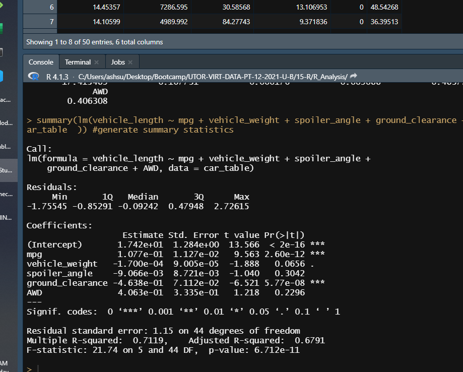
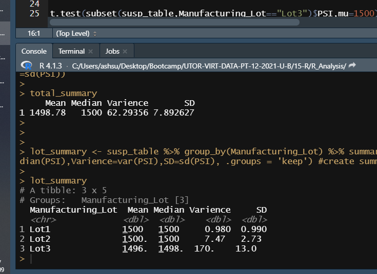
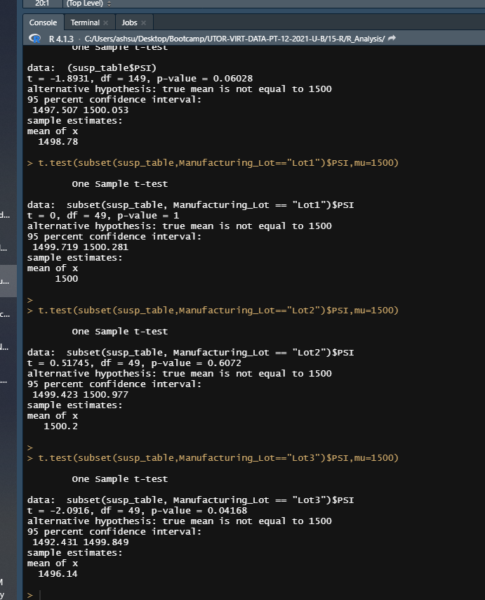

# MechaCar Statistical Analysis
Using RStudio to analyze data

Overview of Project

-Purpose

A few weeks after starting his new role, Jeremy is approached by upper management about a special project.
 AutosRUs’ newest prototype, the MechaCar, is suffering from production troubles that are blocking the manufacturing
 team’s progress. AutosRUs’ upper management has called on Jeremy and the data analytics team to review the production
 data for insights that may help the manufacturing team.

- Analysis and description of visualization

## Linear Regression to Predict MPG.

In addition to overall model fit and the statistical test for slope, we should look at the contribution of each variable to the multiple linear regression model.
To determine which variables provide a significant contribution to the linear model, we must look at the individual variable p-values.
Based on the table Vehicle weight and All wheel drive (AwD) have a direct impact on mpg values.
The slope of the linear model is not zero, or m ≠ 0 as seen by the intercept values
yes, the linear model predict mpg of MechaCar prototypes effectivelybecause of the R suared values

## Summary Statistics on Suspension

Only Lot 1 meets the criteria. 

Lot 2 and 3 dont meet the criteria.

Yes it meets the critera in total.

## T-Tests on Suspension Coils

Assuming a confidence level of 0.05

All lots together - Accept the null hypothesis.

Lot 1 - Accept the null hypothesis.

Lot 2 - Accept the null hypothesis

Lot 3 - Accept the Alternative Hypothesis

## Study Design: MechaCar vs Competition

Metric to be tested - Serviving cost (including cost to replace tyres, brake pads and battery and their life)

Null Hypothesis - There is no significant difference in servicing cost (including life of key parts) between MechaCar and the Competition

Statistical test - Use a ANOVA table to test the hypothesis and then further drill down based on results.

Data - Information on MechCar and its closest competitors - on servicing costs and cost of keys parts and their life,for the first 5 years of the life ofa car.

